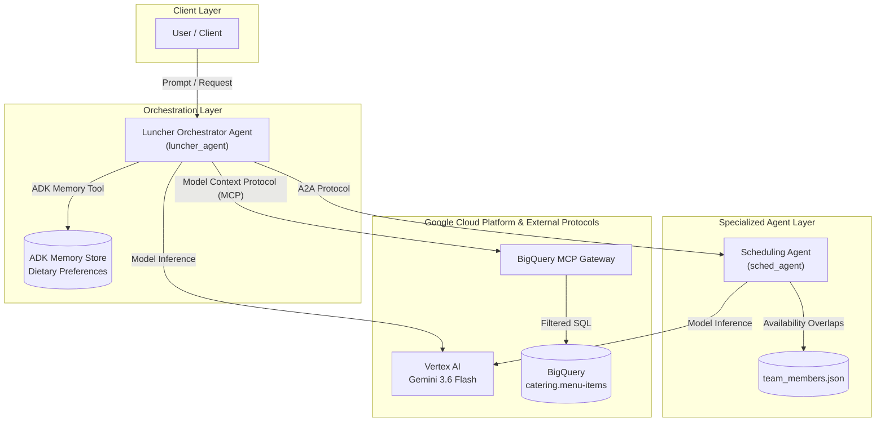

# Lite Luncher

Lite Luncher is an agentic platform designed to automate catered team lunch scheduling and strategy-aligned menu selection by matching team availability and dietary constraints against menu inventory.

(It's a stripped-down and heavily tweaked variant of [Luncher](https://github.com/mbychkowski/luncher).)

---

## Architecture Overview

---

## Agents & System Components

### 1. Central Luncher Orchestrator (`luncher_agent`)
- **Framework**: Google Agent Development Kit (ADK)
- **Model**: `gemini-3.6-flash`
- **Role**: Cognitive frontend and coordinator. Processes user prompts and executes a 4-step pipeline:
  1. Delegates team availability checks to `sched_agent` via A2A protocol.
  2. Retrieves team dietary restrictions from ADK Memory (`load_memory`).
  3. Executes filtered SQL queries against BigQuery catering menu tables via MCP (`execute_sql`).
  4. Synthesizes meeting proposals, attendee lists, applied dietary constraints, and menu option breakdowns.
- **State Management**: Writes user dietary preferences (e.g., allergies, restrictions) to ADK Memory via `save_food_preference`.

### 2. Scheduling Agent (`sched_agent`)
- **Framework**: Google ADK + FastAPI (`to_a2a`)
- **Model**: `gemini-3.6-flash` via Vertex AI
- **Role**: Specialized sub-agent responsible for availability calculation.
- **Functionality**: Pre-computes weekly availability overlaps across team member profiles (`team_members.json`) and returns structured proposals (`SchedulingResponse` Pydantic schema) over A2A.

---

## Protocols & Integrations

- **Agent-to-Agent (A2A) Protocol**: Enables modular, standardized agent-to-agent communication via HTTP card discovery (`/.well-known/agent-card.json`).
- **Model Context Protocol (MCP)**: Integrates `luncher_agent` with Google BigQuery MCP endpoint (`https://bigquery.googleapis.com/mcp`) using Google Application Default Credentials (ADC) for schema querying.
- **ADK Toolset**: Integrates `AgentTool`, `McpToolset`, `FunctionTool`, and `Memory` APIs for execution control.

---

## Cloud Services & Deployment Architecture

- **Google Cloud Run / Agent Runtime**: Serverless hosting environment for agent microservices (`luncher-agent` and `sched-agent`).
- **Google BigQuery**: Data warehouse hosting the catering menu dataset (`catering.menu-items`).
- **Google Vertex AI**: Managed foundation model execution platform for `gemini-3.6-flash`.
- **GCP Workload Identity**: Keyless OIDC authentication for deployment pipelines.
